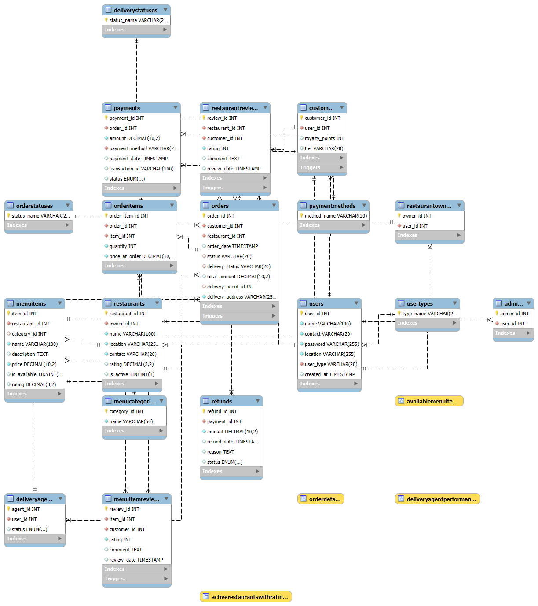

# MadXonFoodDB: A Relational Database for a Food Ordering Application

This repository contains the SQL schema definition for `MadXonFoodDB`, a relational database designed to support a comprehensive 
food ordering application. It includes tables to manage users, restaurants, menus, orders, payments, reviews, and delivery operations.

## Overview

The database is structured to efficiently store and manage data related to:

* **Users:** Customers, Restaurant Owners, Delivery Agents, and Admins.
* **Restaurants:** Details, menus, and operational status.
* **Menu:** Categories and individual items with descriptions and pricing.
* **Orders:** Tracking order status, items, delivery information, and payments.
* **Payments:** Recording payment details and status.
* **Reviews:** Customer feedback on restaurants and menu items.
* **Delivery:** Managing delivery agents and the delivery process.

The schema includes various constraints, foreign keys, and enums to ensure data integrity and consistency. Additionally, a set of 
stored procedures, triggers, and (as indicated in the SQL script) planned functions are included to facilitate common application operations.

## Database Schema

The database consists of the following tables:

* **UserTypes:** Enumerates the different types of users (Customer, RestaurantOwner, DeliveryAgent, Admin).
* **Users:** Stores core user information (name, contact, password, location, user type).
* **Customers:** Specific details for customer users (royalty points, tier).
* **RestaurantOwners:** Links users to the restaurants they own.
* **DeliveryAgents:** Information about delivery agents (status).
* **Admins:** Information for administrative users.
* **Restaurants:** Details about restaurants (owner, name, location, contact, rating, active status).
* **MenuCategories:** Categorizes menu items.
* **MenuItems:** Details of individual menu items (name, description, price, availability, rating).
* **OrderStatuses:** Enumerates the possible statuses of an order (Placed, Preparing, Pending, Completed, Cancelled).
* **DeliveryStatuses:** Enumerates the possible statuses of a delivery (Preparing, OutForDelivery, Delivered).
* **Orders:** Main order information (customer, restaurant, date, status, delivery details, total amount).
* **OrderItems:** Lists the items included in each order with quantity and price at the time of order.
* **PaymentMethods:** Enumerates the supported payment methods (Cash, CreditCard, DebitCard, UPI, Wallet).
* **Payments:** Records payment transactions (order, amount, method, date, transaction ID, status).
* **Refunds:** Details of refund transactions (payment, amount, date, reason, status).
* **RestaurantReviews:** Customer reviews for restaurants.
* **MenuItemReviews:** Customer reviews for individual menu items.

## Stored Procedures

The database includes a comprehensive set of stored procedures to handle common operations:

**User Management:**

* `AddUser`: Adds a new user to the system with details for their specific user type.
* `UpdateUser`: Updates the information of an existing user.
* `DeleteUser`: Removes a user from the system.

**Restaurant & Menu Management:**

* `AddRestaurant`: Registers a new restaurant.
* `UpdateRestaurant`: Modifies the details of an existing restaurant.
* `DeleteRestaurant`: Removes a restaurant.
* `AddMenuItem`: Adds a new item to a restaurant's menu.
* `UpdateMenuItem`: Modifies the details of a menu item.
* `DeleteMenuItem`: Removes a menu item.

**Ratings & Reviews:**

* `RateRestaurant`: Allows customers to rate and review restaurants.
* `RateMenuItem`: Allows customers to rate and review menu items.

**Order Management:**

* `PlaceOrder`: Creates a new order.
* `AddOrderItem`: Adds an item to an existing order.
* `RemoveOrderItem`: Removes an item from an order.
* `UpdateOrderStatus`: Changes the status of an order.
* `CancelOrder`: Cancels an entire order and processes refunds if necessary.
* `CancelOrderedItem`: Cancels a specific item within an order and processes partial refunds.

**Payments & Refunds:**

* `MakePayment`: Records a payment for an order and potentially assigns a delivery agent.
* `ProcessRefund`: Updates the status of a refund and potentially adjusts customer loyalty points.

**Delivery Management:**

* `AssignDeliveryAgent`: Assigns an active delivery agent to an order.
* `UpdateDeliveryStatus`: Updates the delivery status of an order.

## Triggers

The database utilizes triggers to automate certain actions:

* `after_restaurant_review_insert`: Automatically updates the average rating of a restaurant after a new review is added.
* `after_menu_item_review_insert`: Automatically updates the average rating of a menu item after a new review is added.
* `(Commented out in the SQL) Trigger to update customer tier based on royalty points`: This trigger was intended to automatically
              update a customer's tier based on their accumulated royalty points (the specific logic would need to be implemented).

## Planned Functions

The SQL script includes a section for planned functions. These could be used for more complex data retrieval or manipulation tasks 
(e.g., calculating delivery fees, determining customer loyalty tier based on points, etc.).

## Getting Started

To use this database schema:

1.  Ensure you have a MySQL server running.
2.  You can execute the `CREATE DATABASE` and subsequent `CREATE TABLE` and `INSERT INTO` statements in the provided SQL script to set up the database and initial enum values.
3.  The stored procedures can be created by executing the `DELIMITER //` blocks in the script.
4.  Triggers will be automatically created when their corresponding `CREATE TRIGGER` statements are executed.

## Potential Enhancements

* Implement the logic for the commented-out trigger to update customer tiers.
* Develop the planned functions for more advanced application logic.
* Add indexes to frequently queried columns to improve database performance.
* Consider adding more detailed logging or auditing capabilities.
* Explore database normalization further if needed based on application growth and data complexity.

## Author

[VIGNESH L/MadXon]
